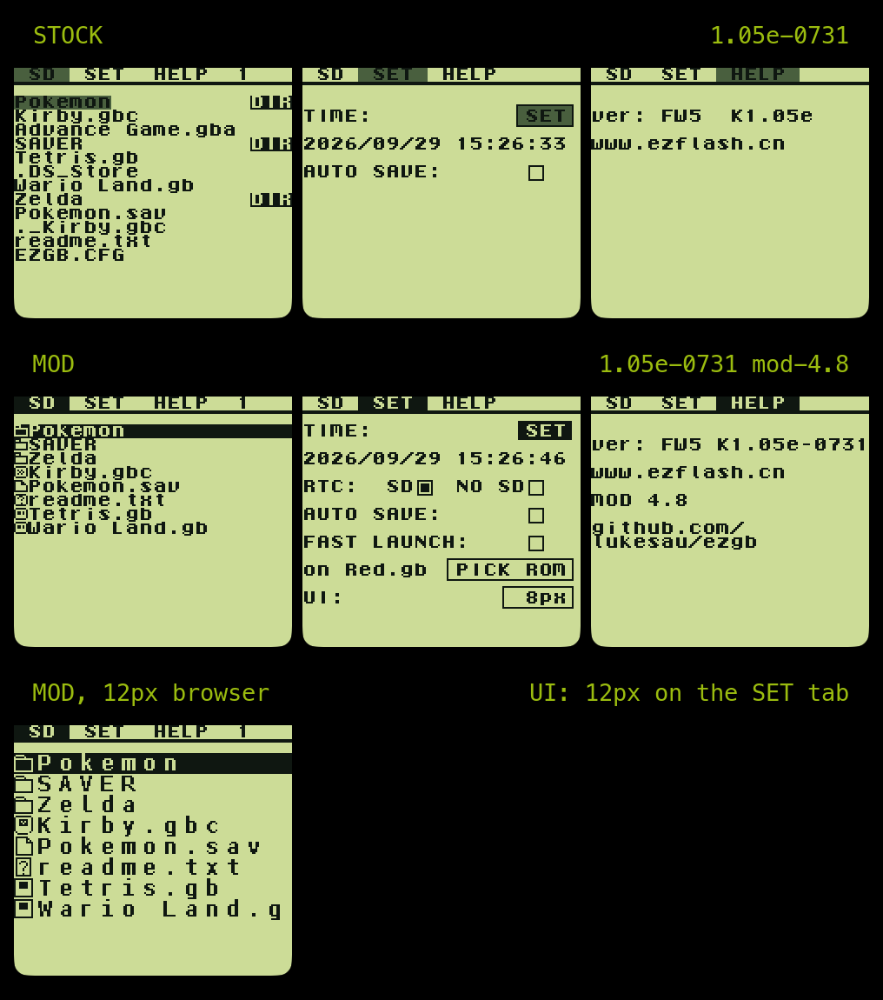

# EZ Flash Jr kernel: reverse engineering & mods



The EZ Flash Jr is a Game Boy / Game Boy Color flash cartridge. Its menu/OS
firmware (the "kernel") runs on the stock Game Boy CPU (SM83) and, unlike its
GBA sibling the [EZ Flash Omega](https://github.com/ezflash-team/omega-de-kernel),
ships only as a compiled binary with no published source.

This repo reverse-engineers that kernel and adds new features you can compile
into your own cartridge.

## Getting the modded kernel

Patch the official kernel with the IPS file from the
[latest release](https://github.com/lukesau/ezgb/releases/latest). Nothing is
flashed: the Jr loads `ezgb.dat` from the microSD card at every power-on. Swapping the kernel is as simple as changing a file and is completely reversible.

1. Take `ezgb.dat` from EZ Flash's official firmware package (or the one on
   your card's root now).
2. Download the matching `ezgb-mod-N.M-for-<kernel>.ips` from the release:

   | Kernel | Package | Stock `ezgb.dat` md5 |
   |---|---|---|
   | 1.04e | `juniorkernel-1.04e-FW4` | `b8c29fa5a94c37200434e4c72f0cdfea` |
   | 1.05e-0731 | `juniorkernel-1.05e-FW5-0731` | `91eb7fc67332ef20b5691029181ff748` |
   | 1.05e-0918 | `juniorkernel-1.05e-FW5-0918` | `5238ac5987d23b68a19d40e43af8c786` |

3. Apply it with any IPS patcher, e.g.
   [Rom Patcher JS](https://www.marcrobledo.com/RomPatcher.js/) in the
   browser, Flips, or MultiPatch.
4. Copy the result to the card root as `ezgb.dat` (keep the stock file to go
   back). The HELP tab shows `MOD N.M` when it's running.

The release's README has the patched md5s and per-OS patcher notes. The 1.04e
build also runs on an FW5 cart, so no firmware updater is ever needed to
switch.
[Which official kernel should I choose?](docs/kernel-versions.md)

This repo never redistributes EZ Flash's binaries, so a ready-made `ezgb.dat`
is not downloadable here. If you have a checkout,
`python3 scripts/kernel-patch.py apply ezgb.dat` applies the patch from
[`patches/kernel/`](patches/kernel/) and verifies md5s, and
`scripts/build-kernel.sh 1.05e-0731 --install` reassembles the same bytes
from the disassembly with rgbds. Details, checksums, and the copyright
rationale: [`docs/distribution.md`](docs/distribution.md). To pick features
individually or hack on new ones, see
[building from your own dump](#building-a-modded-kernel-from-your-own-dump).

## Features

Every release includes all of these, for the 1.04e and 1.05e kernels (all
three official builds). Each is also a self-contained patch you can build in on
its own; each doc has the rationale, wiring, and exact commands.

| Feature | What it does | Doc |
|---|---|---|
| **Sorted browser** | Directories first, then files, each group alphabetical (case-insensitive), instead of raw FAT order. | [`docs/browser-sort.md`](docs/browser-sort.md) |
| **Continuous scrolling** | DOWN/UP scroll one line past the screen edge instead of stopping at the top/bottom row. | `decomp/src/browser_scroll.c` |
| **Snappy down-scroll** | Repaints bottom-up so the new entry appears immediately on DOWN. | [`docs/browser-scroll-repaint.md`](docs/browser-scroll-repaint.md) |
| **RIGHT jumps to end** | RIGHT on the last page moves the cursor to the bottom entry, mirroring LEFT at the top. | [`docs/browser-page-end.md`](docs/browser-page-end.md) |
| **DMG-readable highlight + file icons** | Every highlight (browser selection, tab strip, SET-tab buttons, prompts and Loading boxes) is white on black instead of black on dark gray, which is unreadable on an original Game Boy. The browser selection bar spans the full row, and every row starts with an icon: folder, .gb cart, .gbc cart, .sav page, or a boxed ? for anything else. | [`docs/dmg-ui-visibility.md`](docs/dmg-ui-visibility.md) |
| **12px UI** | An opt-in larger menu font: a proportional 12px-tall font with kerning instead of 8x8 cells, so a row is the icon plus as many characters as fit (about 18 of a typical name; `Pokemon Crystal.gbc` fits without scrolling) and a page shows 10 entries (longer names scroll). The tab strip, the SET and HELP tabs, the START overlay, the boot prompts and the Reading / Loading / Error boxes follow the same mode. Switch it on with the `UI:` button on the SET tab (`UI=12` in `/EZGB.CFG`); the stock 8px layout stays the default. | [`docs/font12.md`](docs/font12.md), [`docs/ui-mode.md`](docs/ui-mode.md), [`docs/tab-strip12.md`](docs/tab-strip12.md), [`docs/set-pane12.md`](docs/set-pane12.md) |
| **Closed boxes on the START overlay and boot prompts** | The stock START overlay and BACKUPSAVE prompt draw their frames first and their text over them, and the text cells repaint parts of the frames, leaving bracket-like stubs. Each is now one closed box: a title (`Launch Last ROM?`, `Back up save?`), the file name in white on a black band (scrolling when long), and the two options with a rule between them. The save prompt also shows when the game was last played, and counts dots after `Saving` while it writes. The RTC restore prompt has the same look. | [`docs/last-rom.md`](docs/last-rom.md), [`docs/modal-prompts.md`](docs/modal-prompts.md) |
| **Safe with a bad or missing battery** | The kernel keeps its between-boot records (the "backup pending" save stamp, the last-launched ROM, the clock) in battery-backed cart RAM, and with a dead or missing coin cell that RAM fades while the cart is off. The stock kernel trusts whatever it finds there: on boot it prompts to back up a save with a long garbled name, and pressing A dumps garbage to the SD card under that name. Every one of these records is now checked before it is used. A save stamp that is not a real `/SAVER/` path is ignored and the cart boots to the browser, a corrupt last-ROM record falls back to `LASTROM=` in `/EZGB.CFG`, and a clock that has reset or reads as garbage gets a restore prompt from its SD backup (see the two rows at the end of this table). | [`docs/modal-prompts.md`](docs/modal-prompts.md), [`docs/last-rom.md`](docs/last-rom.md), [`docs/ezgb-cfg.md`](docs/ezgb-cfg.md) |
| **No lost button presses** | The stock menus sample the pad once per loop (3 to 6 frames), so a quick tap can fall between two samples and do nothing. The pad is now sampled every frame from the VBlank interrupt and presses are latched, so any tap of one frame or more is acted on at the next poll. This is most of why the menus feel snappier. | [`docs/joypad-latch.md`](docs/joypad-latch.md) |
| **No streak artifacts** | The stock text drawer checks the LCD mode with interrupts enabled, so now and then a pixel row of one tile is dropped: the thin one-tile streaks (or an underline under a letter of `Reading...`) that stay until the tile is redrawn. Every VRAM write is now made inside a short interrupt-free window right after the check, in both the 8px and 12px browsers. | [`docs/vram-write-race.md`](docs/vram-write-race.md) |
| **Path overflow guard** | Entering a directory whose full path would overflow the browser's 255-byte path buffer (and corrupt the save-file path) is a no-op instead. | [`docs/path-length.md`](docs/path-length.md) |
| **Version on HELP tab** | The HELP screen shows the kernel date (`K1.05e-0731`), the mod version (`MOD 5.0`), and a `github.com/lukesau/ezgb` link, so you can tell which build a card is running. Stamp it with `scripts/stamp-mod-version.sh`. | — |
| **Hide clutter** | Filters macOS cruft (`._*` sidecars, `.DS_Store`, `.Spotlight-V100/` etc.), unlaunchable `*.gba` ROMs, and the settings file (`EZGB.CFG`, plus a leftover `FLAUNCH.CFG`) from the browser. | [`docs/browser-hide-filter.md`](docs/browser-hide-filter.md) |
| **Fast launch** | Boots straight into a ROM, skipping the browser: the ROM named by `FLAUNCH=` in `/EZGB.CFG`, or the card's only root ROM. Falls through to the browser when neither applies. **Hold START on boot (fast launch check happens after save prompt, if applicable) to skip fast launch and boot to the browser instead.** | [`docs/fast-launch-notes.md`](docs/fast-launch-notes.md) |
| **Fast-launch SET tab** | Configure fast launch on the cart itself: a FAST LAUNCH enable/disable checkbox on the SET tab, the target's name (scrolling when long), and a PICK ROM button that chooses the target in the file browser. Writes `/EZGB.CFG`. | [`docs/fastlaunch-set-tab.md`](docs/fastlaunch-set-tab.md) |
| **RTC backup to SD** | Keeps a copy of the real-time clock in `/EZGB.CFG` (updated at every game launch, save-to-SD dump and TIME SET). At boot, if the clock has reset to 2000, gone backwards or reads as garbage, a prompt shows the chip's time next to the backup and restores the backup on A or leaves the value on B. This is because a weak coin cell can reset the time and restoring a backup goes back to your last launch time instead of resetting the clock to 2000. RTC games (Pokemon Crystal, Gold/Silver) also keep their clock when the cart's clock moves backwards, instead of resetting to their stored start time. An `RTC: SD / NO SD` setting on the SET tab (`RTCSD=`) turns the whole backup off for people who don't care about RTC features or don't have a battery installed. | [`docs/ezgb-cfg.md`](docs/ezgb-cfg.md) |
| **SGB BOOT** | Makes the Jr work on a Super Game Boy, after nitro2k01's 2021 SGB Enabler: with `SGB BOOT:` ticked on the SET tab, the kernel sends the cartridge header the SNES waits for, which the Jr's late CPU start makes it miss. Tick it on a handheld, then move the cart; boots take about 7 s longer while it is on. Not yet confirmed on a real Super Game Boy. | [`docs/sgb-boot.md`](docs/sgb-boot.md) |
| **Last-ROM fallback** | The START overlay's last-launched ROM lives in battery-backed cart RAM, which is lost when the coin cell fails. Every launch also writes `LASTROM=` to `/EZGB.CFG`, and the overlay falls back to it when the RAM record is corrupt, so START still relaunches the last game. | [`docs/last-rom.md`](docs/last-rom.md), [`docs/ezgb-cfg.md`](docs/ezgb-cfg.md) |

Once built, **fast launch is driven entirely from the card** (no rebuild to
change what boots), in priority order: a `FLAUNCH=` line in the `/EZGB.CFG`
text file naming the ROM path (root or a subfolder, e.g. `/Pokemon/Blue.gb`); else the
root's only ROM. Anything else boots to the normal browser. Folders, `ezgb.dat`,
and dot-files/macOS junk are ignored. A leading `#` on the `FLAUNCH=` value
disables fast launch entirely (every trigger skipped) while
keeping the path for later. **Hold START at power-on to skip fast launch and go to
the browser.** You can also configure all of this **from the cart's SET tab** (a
FAST LAUNCH checkbox and a ROM PICK button that rewrite `/EZGB.CFG`); see
[`docs/fastlaunch-set-tab.md`](docs/fastlaunch-set-tab.md). The whole feature is confirmed on real hardware (Game
Boy Color and Game Boy Advance SP): fast launch from a config file (root and
subfolder paths), the lone-ROM rule, the hold-a-button cancel, and the no-flash pre-paint hook that skips straight to Loading without the
browser flashing. The cancel button is START (it was B, then SELECT, in earlier revisions).

**CGB mode (inactive on real carts):** since mod 5.3 the kernel's header
declares it CGB-compatible and it sets up a grayscale CGB palette when it runs
in CGB mode, the first step toward using the GBC IR port. A real Jr still boots
the kernel in DMG compatibility mode, which can't be changed without FPGA
firmware changes, so on hardware the code skips itself and nothing changes.
Emulators that honor `ezgb.dat`'s header run it in CGB mode:
[`docs/cgb-mode.md`](docs/cgb-mode.md).

## Where the project is

The reverse engineering is essentially done:

- **Full disassembly.** Every bank is labeled, and it reassembles to the exact
  original firmware (both the 1.04e and 1.05e builds; only 3 cosmetic
  ROM-header bytes differ).
- **Hardware understood:** the FPGA unlock/command/commit registers, SD sector
  I/O, bank switching, PSRAM save storage, the board, and the ROM launch path.
  See [`docs/hardware-board.md`](docs/hardware-board.md),
  [`docs/REGISTERS.md`](docs/REGISTERS.md),
  [`re/stage0/docs/flash-map.md`](re/stage0/docs/flash-map.md),
  [`docs/launch-trace.md`](docs/launch-trace.md). Why the coin cell dies in a
  month and the drop-in SRAM fix: [`docs/battery-sram-swap.md`](docs/battery-sram-swap.md).
- **Code injection works.** You can compile C, place it in verified-free ROM,
  hook it into the kernel, and run it on real hardware and in emulator. The
  features above are built on this. Recipe and free-space map:
  [`docs/inject-smoke-test.md`](docs/inject-smoke-test.md).

## Building a modded kernel from your own dump

Drop your firmware dump at `re/1.05e-0731/kernel.gb` (a copy of the
`ezgb.dat` from the official firmware package), then:

```sh
# 1. Regenerate the disassembly from your dump (one-time per version)
cd re/1.05e-0731
python3 ../../tools/mgbdis/mgbdis.py kernel.gb --overwrite
../../scripts/annotate-disasm.py 1.05e-0731

# 2. Apply features (example: sorted browser; see each doc for its commands)
cd ../../decomp
python3 tools/inject.py src/browser_sort.c 1.05e-0731 8 746b BrowserSortAll \
    --pin DirList=0a43 --apply
python3 tools/inject_bytes.py 1.05e-0731 0 03d4 BrowserSortAllStub \
    cd8d076b740800c9 --apply
python3 tools/patch_call.py 1.05e-0731 0 102f 3 00:03d4 --apply --regen

# 3. Build the emulator card image (the kernel is copied in as ezgb.dat)
cd ..
scripts/make-sd-image.sh
# ...or a card-ready dist/mod-N.M/ezgb-mod-N.M-for-1.05e-0731.dat
scripts/build-ezgb-dat.sh 1.05e-0731
```

Injection edits `re/1.05e-0731/kernel.gb` in place, so it becomes the patched
artifact. Features are developed against 1.05e-0731 and carried to the other
two kernels mechanically by `scripts/port-mod.py` (see
[`docs/DEVELOPMENT.md`](docs/DEVELOPMENT.md#porting-the-mod-to-another-kernel-build)). Run it in SameBoy (with the EZ Jr FPGA stub, see
[`docs/DEVELOPMENT.md`](docs/DEVELOPMENT.md#tools)), or copy `ezgb.dat` to the
root of a real cart's microSD. Hook-site rules and the free-space map:
[`docs/inject-smoke-test.md`](docs/inject-smoke-test.md).

## Repo layout

```
re/               Disassemblies, one dir per firmware version (1.04e, 1.05e-0731, 1.05e-0918)
  1.05e-0731/     Primary target; disassembly/ reassembles to the original
                  (1.04e and 1.05e-0918 are ports of it: scripts/port-mod.py)
    kernel.sym    Persistent names     (kernel.gb is your own dump, not tracked)
    notes.json    Persistent comments
decomp/           Matching C decompilation + injectable feature sources
  src/            browser_sort.c, browser_scroll*.c, fastlaunch*.c, cgb_init.c, ...
  tools/          inject.py, inject_bytes.py, patch_call.py, verify.py
docs/             Findings, feature write-ups, hardware notes
scripts/          Disassembly regen, mapping loop, SD image, SameBoy helpers
patches/kernel/   IPS patches: stock ezgb.dat -> modded kernel (safe to share)
patches/sameboy/  EZ Jr FPGA stub as diffs over a pinned SameBoy commit
sd/               Local microSD image for the emulator     (untracked; see docs/DEVELOPMENT.md)
fpga/, tools/     FPGA dumps and cloned reference repos     (not tracked)
```

Untracked paths are gitignored: EZ Flash's copyrighted binaries (firmware,
`kernel.gb`, FPGA bitstreams) or third-party repos. A fresh checkout supplies
its own dump and re-clones `tools/` (see
[`docs/DEVELOPMENT.md`](docs/DEVELOPMENT.md#tools)). Name a specific version;
the FW5 packages differ
([`docs/DIFF_1.05e-0731_vs_0918.md`](docs/DIFF_1.05e-0731_vs_0918.md)).

## Digging deeper

- **[`docs/DEVELOPMENT.md`](docs/DEVELOPMENT.md)**: rebuild the disassembly,
  name functions, inject code, verify the decompilation, set up tools. Start
  here to contribute.
- **Hardware:** [`docs/hardware-board.md`](docs/hardware-board.md),
  [`docs/REGISTERS.md`](docs/REGISTERS.md),
  [`docs/fpga.md`](docs/fpga.md) (FPGA docs index and setup),
  [`re/stage0/docs/flash-map.md`](re/stage0/docs/flash-map.md),
  [`re/stage0/docs/bitstream.md`](re/stage0/docs/bitstream.md),
  [`re/stage0/docs/picoblaze.md`](re/stage0/docs/picoblaze.md),
  [`re/stage0/docs/fw5.md`](re/stage0/docs/fw5.md),
  [`docs/fpga-cgb.md`](docs/fpga-cgb.md),
  [`re/stage0/docs/toolchain.md`](re/stage0/docs/toolchain.md),
  [`docs/game-slot-access.md`](docs/game-slot-access.md),
  [`docs/psram-save-map.md`](docs/psram-save-map.md).
- **Boot & launch:** [`docs/boot-map.md`](docs/boot-map.md),
  [`docs/ezgb-dat-boot.md`](docs/ezgb-dat-boot.md),
  [`docs/launch-trace.md`](docs/launch-trace.md),
  [`docs/last-rom.md`](docs/last-rom.md).
- **Version diffs:** [`docs/DIFF_1.04e_vs_1.05e.md`](docs/DIFF_1.04e_vs_1.05e.md),
  [`docs/DIFF_1.05e-0731_vs_0918.md`](docs/DIFF_1.05e-0731_vs_0918.md),
  [`docs/1.05e-instability.md`](docs/1.05e-instability.md).
- **Methodology:** [`docs/MAPPING.md`](docs/MAPPING.md).

## Credits

- **[daid/ezflashjr](https://github.com/daid/ezflashjr)** by Daid, with
  contributions from nitro2k01: the cart's register protocol
  (`doc/Protocol.md`), stage1 dumps, board survey, and archived official
  firmware. The SameBoy EZ Jr stub's game-launch path is built on its protocol
  doc, and several hardware docs here start from its findings.
- **[prjcombine](https://codeberg.org/prjunnamed/prjcombine)**: coolest
  project ever. I thought reverse engineering the FPGA bitstream would be a
  research project of its own, but they already did that research.
- **[omega-de-kernel](https://github.com/ezflash-team/omega-de-kernel)**: EZ
  Flash's published GBA kernel source, used to interpret the Jr's register
  design.
- **[SameBoy](https://github.com/LIJI32/SameBoy)**,
  **[mgbdis](https://github.com/mattcurrie/mgbdis)**,
  **[rgbds](https://github.com/gbdev/rgbds)** and pret's
  **[gb-asm-tools](https://github.com/pret/gb-asm-tools)**: emulation,
  disassembly, and assembly.

## License

AGPLv3, see [LICENSE](LICENSE). Covers this project's own work (disassembly,
notes, tooling, feature code). It does not relicense EZ Flash's original
firmware, which is not redistributed here.
